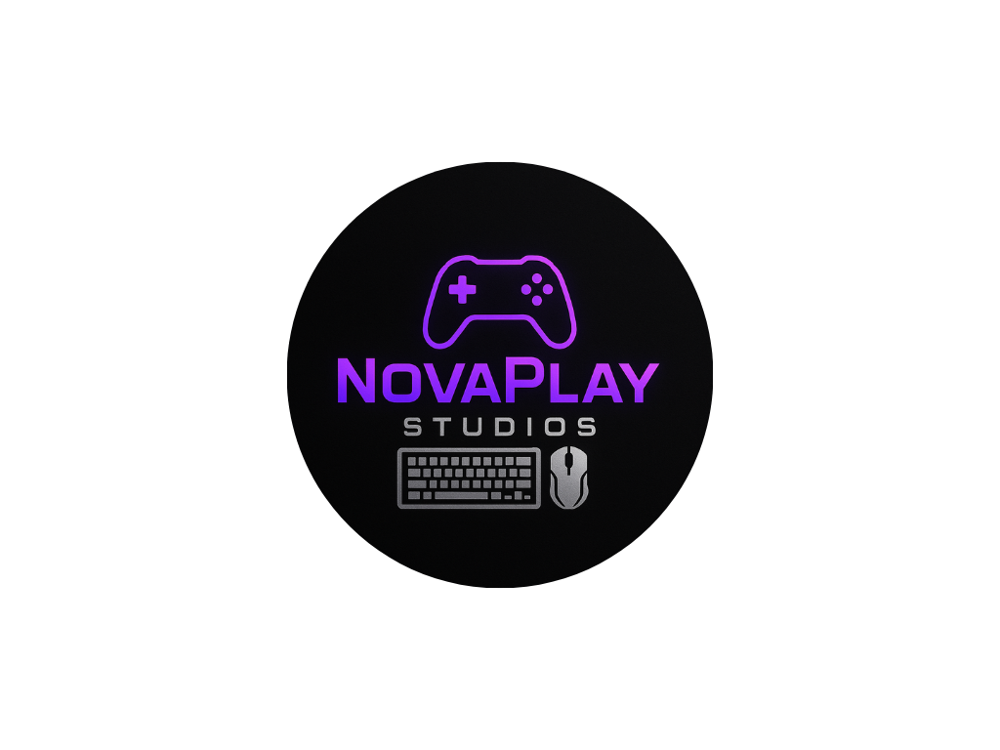

# 🏢 Présentation de l'entreprise

## 📝 Contexte
> ⚠️ Remarque importante  
Cette entreprise est totalement fictive, créée avec l’aide de ChatGPT dans le cadre d’un projet personnel. Elle n’existe pas dans la réalité.

Dans le cadre d'un **laboratoire d'apprentissage** d'une infrastructure système et réseau, avoir une entreprise (fictive) permettra de se rapprocher au plus de la réalité de l'**administration de l'infrastructure**.

C'est pourquoi avec l'aide de **ChatGPT**, j'ai simulé une entreprise de 50 employés.

## ✨ Description de l'entreprise
### 🏢 NovaPlay Studios
👉 Un studio de création de jeux vidéo indépendant qui mise aussi sur le streaming (YouTube/Twitch) pour sa communication et son marketing.

### 🎮 Que fait l’entreprise ?
**NovaPlay Studios** est un studio indépendant spécialisé dans la création de jeux vidéo orientés **multijoueur compétitif** et **expérience communautaire**.
- 🎮 **Développement de jeux vidéo** : conception, design, développement et publication de jeux.
- 📺 **Streaming et communication** : les équipes produisent du contenu live (Twitch/YouTube) pour promouvoir les jeux et fidéliser la communauté.
- 👥 **Communauté & support** : mise en place de forums, discords, support technique et modération pour les joueurs.
- ☁️ **Technologie & innovation** : hébergement de serveurs de jeux, solutions cloud hybrides pour test et déploiement, outils collaboratifs internes.

### 🧩 Départements et services
L'entreprise est composée de **5 départements principaux** :
1. Direction & Administration
   - CEO, RH, comptabilité, juridique
2. Développement Jeux Vidéo
   - Game design, programmation, graphisme, animation 3D, sound design
3. Streaming & Communication
   - Production vidéo, streaming en direct, community managers, marketing digital
4. Support & Qualité
   - Testeurs QA, support technique (SAV), modérateurs
5. Infrastructure & IT
   - Administrateurs systèmes/réseaux, sécurité informatique, gestion des serveurs

### 👥 Liste des employés
La liste complète des employés est disponible ici :  
➡️ [Voir la liste des employés](./Ressources/employe.md)

## 🙋‍♂️ Pourquoi suis-je là ?

Actuellement, **NovaPlay Studios** fonctionne avec une infrastructure très basique :  
- une simple connexion fournie par le **FAI**,  
- des **PC portables en session locale** pour les employés,  
- une **messagerie standard** (type Gmail/Outlook) pour la communication,  
- aucun annuaire centralisé, aucun firewall dédié, ni serveurs internes.  

Cette configuration, bien qu’utile au démarrage, n’est **pas adaptée** à la croissance de l’entreprise ni à ses activités critiques (développement de jeux multijoueur, streaming, support communautaire).  

👉 Mon rôle est de mettre en place une **infrastructure professionnelle et sécurisée**, incluant :  
- un **réseau structuré et segmenté** (LAN, VLAN, DMZ),  
- des **services centralisés** (AD-DS, DHCP/DNS, serveur de messagerie interne),  
- des **mécanismes de supervision, sauvegarde et sécurité avancée** (pare-feu, politiques d’accès, PRA).  

L’objectif est de donner à NovaPlay Studios une **véritable infrastructure informatique**, à la fois **fiable, sécurisée et évolutive**, capable de soutenir son développement actuel et futur.

---

👉 Retour à la [page index de l'étape](/Etape1/index.md).  
👉 Retour à la [page principale du projet](/README.md).  